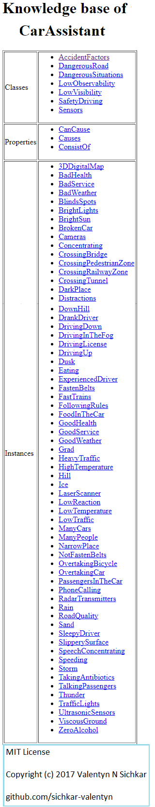
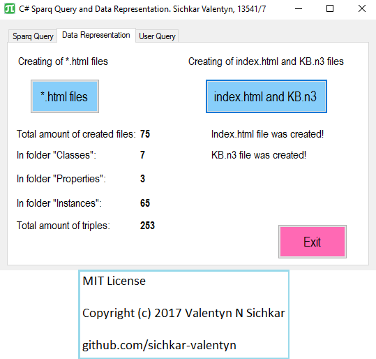
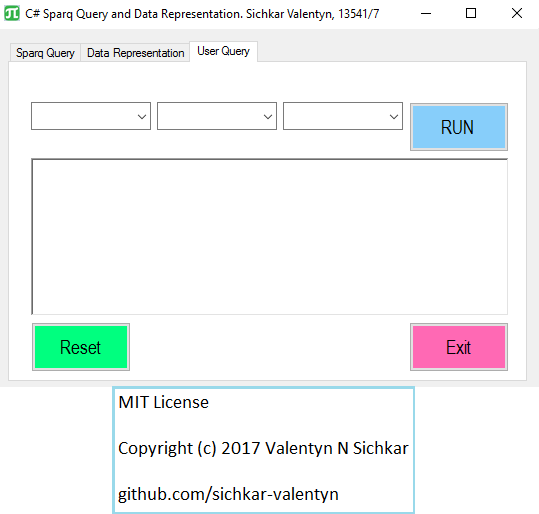
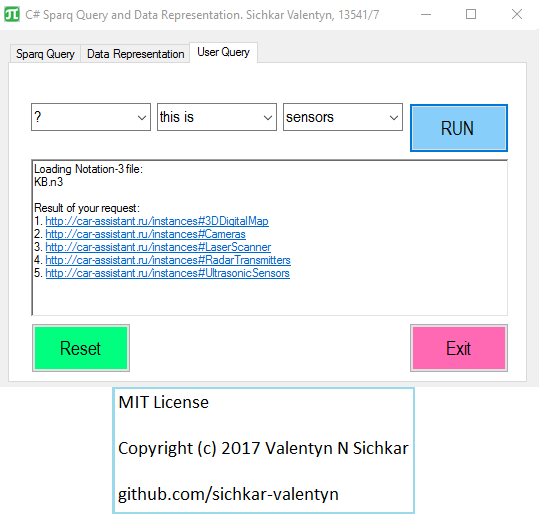
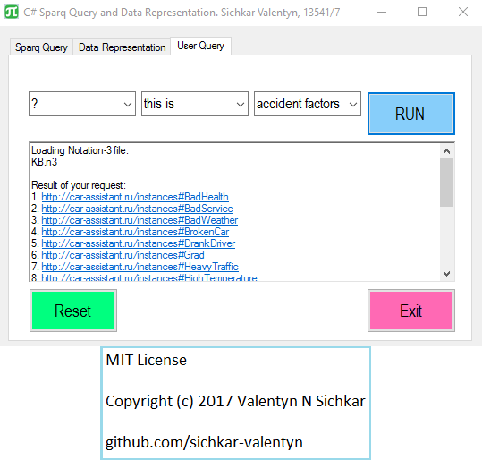

# System programming for SPARQL querying with interface development by html files
System programming in C# for <b>SPARQL querying</b> through Knowledge Base (KB) with interface development by creating *.html* files.

### Courses:
* Explore the course **"Convolutional Neural Networks for Image Classification"** here: https://stepik.org/course/53801/promo

### Reference to:
[1] Valentyn N Sichkar. System programming in C# for SPARQL querying through KB with interface development by creating html files // GitHub platform [Electronic resource]. URL: https://github.com/sichkar-valentyn/System_programming_for_SPARQL_querying_with_interface_development_by_html_files (date of access: XX.XX.XXXX)

## Description
Program creates *.html* files for each class, property and instance. Program generates index.html file out of all *.html* files as well as *KB.n3* file out of all *.n3* files. Also, program provides user interface for <b>SPARQL quering</b> through *KB.n3* file.

## Content
* <a href="#KB index.html file">KB index.html file</a>
* <a href="#Generating index html file out of all html files as well as KB.n3 file out of all n3 files">Generating index html file out of all html files as well as KB.n3 file out of all n3 files</a>
* <a href="#Interface for users querying">Interface for users querying</a>
* <a href="#Finding what are sensors">Finding what are sensors</a>
* <a href="#Finding what are accident factors">Finding what are accident factors</a>

### <a name="KB index.html file">KB index.html file</a>

### <a name="Generating index html file out of all html files as well as KB.n3 file out of all n3 files">Generating index html file out of all html files as well as KB.n3 file out of all n3 files</a>

### <a name="Interface for users querying">Interface for users querying</a>

### <a name="Finding what are sensors">Finding what are sensors</a>

### <a name="Finding what are accident factors">Finding what are accident factors</a>

## MIT License
## Copyright (c) 2017 Valentyn N Sichkar
## github.com/sichkar-valentyn
### Reference to:
[1] Valentyn N Sichkar. System programming in C# for SPARQL querying through KB with interface development by creating html files // GitHub platform [Electronic resource]. URL: https://github.com/sichkar-valentyn/System_programming_for_SPARQL_querying_with_interface_development_by_html_files (date of access: XX.XX.XXXX)
